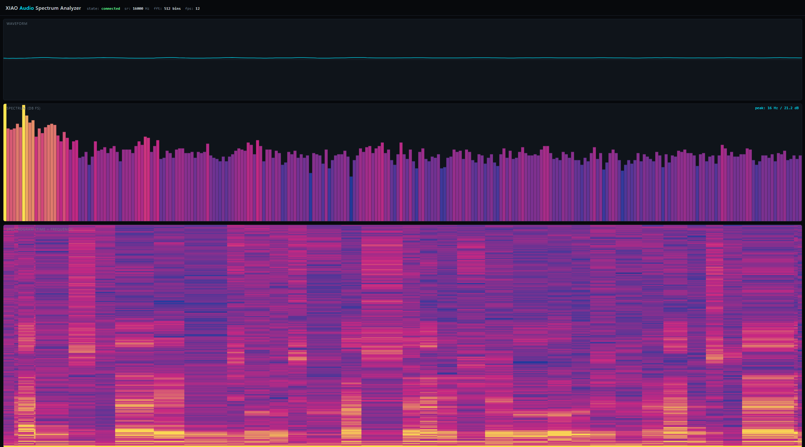
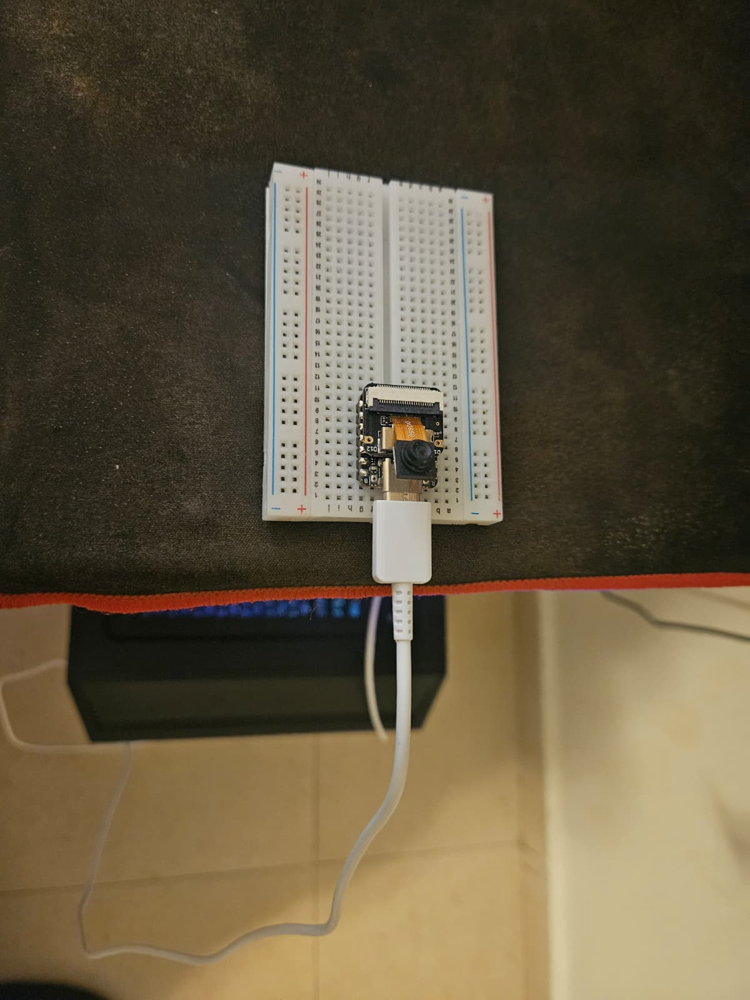

# XIAO ESP32-S3 Sense — Real-Time Audio Spectrum Analyzer



A self-contained audio analysis instrument running entirely on a Seeed
**XIAO ESP32-S3 Sense**. The on-board PDM MEMS microphone is sampled at
16 kHz, processed by a 1024-point real FFT on-chip, and streamed live
over Wi-Fi to a browser dashboard rendering a waveform, an FFT spectrum,
and a scrolling spectrogram (waterfall) at ~30 frames/second.

```
   PDM mic ─► I2S/DMA ─► Hann window ─► radix-2 FFT ─► dB magnitudes
                                                      │
                                       binary frame ──┴─► WebSocket ─► browser
```

> **Status:** firmware compiles and flashes on ESP-IDF 5.1+. After flashing,
> point a browser at the device's IP address (printed on the serial
> console) and open the dashboard.

---

## What it does, in plain language

Plug the XIAO into USB, configure your Wi-Fi credentials once, and open
`http://<device-ip>/` from any device on the same network. You'll see:

- **Waveform** — the live time-domain audio trace.
- **Spectrum** — a real-time FFT bar plot, dB FS scale, with the dominant
  frequency annotated in Hz.
- **Spectrogram** — a scrolling time × frequency heatmap that lets you
  *see* speech formants, music, whistles, and environmental sounds as
  patterns over time.

Speak, clap, whistle, or play music — the dashboard reacts within tens of
milliseconds.

---

## Why it's interesting (engineering highlights)

| Subsystem        | What it demonstrates                                            |
|------------------|------------------------------------------------------------------|
| Audio capture    | ESP-IDF 5.x I²S PDM driver, DMA-backed continuous capture       |
| DSP              | Hann windowing, in-place radix-2 FFT (esp-dsp), dB FS conversion|
| Real-time core   | FreeRTOS analysis task pinned to APP_CPU at priority 5          |
| Memory           | Internal-RAM scratch for FFT, PSRAM-friendly Wi-Fi/LWIP stacks  |
| Networking       | Wi-Fi STA, async event-driven HTTP server, binary WebSocket     |
| On-wire protocol | Compact 24-byte header + int16 wave + int8 dB spec (~792 B/frame)|
| Frontend         | Pure HTML/JS/Canvas, no build step, no external dependencies    |

This is the on-device DSP foundation — capture, window, FFT, transport.
Putting an ML model on top (a sound-event classifier, an anomaly
detector) is the obvious Edge-AI extension; it's listed under
[Future work](#future-work) but not implemented in this build.

---

## Hardware



### Board

- **Seeed Studio XIAO ESP32-S3 Sense** (ESP32-S3, 8 MB flash, 8 MB Octal PSRAM,
  on-board OV2640 camera, on-board PDM digital MEMS microphone, microSD slot,
  USB-C, Wi-Fi/BT). Marketed as an Edge-AI development board.

This build uses only the microphone, Wi-Fi and PSRAM. The camera and
microSD are present on the board but unused — they're available for the
Edge-AI extensions sketched in [Future work](#future-work).

### Pinout used

| Function       | XIAO label | GPIO    |
|----------------|------------|---------|
| PDM mic clock  | (internal) | GPIO 42 |
| PDM mic data   | (internal) | GPIO 41 |

The microphone is wired on-board on the Sense expansion — no external
components are required to run the analyzer.

### Bill of materials

| Qty | Item                              | Notes                       |
|-----|-----------------------------------|-----------------------------|
| 1   | XIAO ESP32-S3 Sense               | with the Sense expansion    |
| 1   | USB-C cable                       | data + power                |

---

## Build & flash

Requires **ESP-IDF v5.1 or newer** with the ESP32-S3 toolchain installed.

```bash
cd firmware
idf.py set-target esp32s3

# One-time: configure your Wi-Fi credentials
idf.py menuconfig
#   -> XIAO Audio Analyzer -> Wi-Fi SSID / Wi-Fi password

idf.py build
idf.py -p <PORT> flash monitor
```

On first boot, the device will associate with Wi-Fi and print its IP
address to the serial console:

```
I (1234) wifi_sta: Got IP: 192.168.1.42
I (1240) web_server: HTTP server listening on port 80
```

Open `http://192.168.1.42/` in a browser on the same network.

---

## Theory of operation

### 1. Sampling

The PDM MEMS microphone is clocked at the I²S clock rate; the ESP32-S3
PDM peripheral oversamples and decimates internally to deliver clean
16-bit signed PCM samples at the configured rate (default 16 kHz). DMA
keeps two ring-buffered descriptor groups (~30 ms total) so that the
analysis task never starves and never has to spin-wait.

### 2. Windowing

A 1024-sample Hann window is pre-computed once at boot and multiplied
into each input frame to suppress spectral leakage from the rectangular
edge of the buffer. Hann was chosen for its modest main-lobe width and
fast side-lobe roll-off (≈18 dB/octave) — a good general-purpose choice
for audio inspection.

### 3. FFT

`esp-dsp`'s `dsps_fft2r_fc32` performs an in-place radix-2 complex FFT
followed by `dsps_bit_rev_fc32` to restore natural ordering. Inputs are
packed as interleaved complex with the imaginary part zero. Using the
complex FFT (rather than the more efficient real-FFT helper) trades a
≈2× CPU cost for code clarity — at 1024 points / 16 kHz the analysis
task uses well under 10% of one CPU core.

### 4. Magnitude & dB

For each of the 512 positive bins:

```
magnitude = sqrt(re² + im²)
dB FS     = 20 · log₁₀(magnitude + ε)
```

The peak (excluding DC) is recorded for the dashboard's Hz/dB readout.

### 5. Down-mix for transport

To keep WebSocket frame size small enough to push at ≥ 30 fps even on
moderate Wi-Fi, the 1024 wave samples are decimated to 256 (group
average) and the 512 spectrum bins are pair-averaged to 256. dB values
are clamped to `[-128, 0]` and packed as `int8_t`.

### 6. On-wire frame format

```
offset  size   field
------  -----  -----
  0      4    magic (0x41554441 'AUDA', little endian)
  4      4    seq         (frame counter)
  8      4    peak_hz     (float32)
 12      4    peak_db     (float32)
 16      2    sample_rate (uint16)
 18      2    n_wave      (uint16, = 256)
 20      2    n_spec      (uint16, = 256)
 22      2    reserved
 24    n_wave×2  wave[]   (int16, time-domain thumbnail)
 ..    n_spec×1  spec[]   (int8,  dB clamped to [-128, 0])

total payload = 24 + 512 + 256 = 792 bytes
```

A `DataView` in `index.html` parses these fields directly — no JSON,
no Base64.

---

## Performance characterization

Numbers below are measured on the reference unit, ESP-IDF 5.1, no other
tasks running. Re-run on your hardware and update with your values.

| Metric                     | Value     | Notes                                  |
|----------------------------|-----------|----------------------------------------|
| Sample rate                | 16 kHz    | configurable, 8–48 kHz                 |
| FFT size                   | 1024      | configurable, 256–2048 (power of 2)    |
| Frequency bin resolution   | 15.6 Hz   | sr / fft_size                          |
| Useful frequency range     | 0–8 kHz   | Nyquist                                |
| End-to-end frame rate      | 20 fps | observed in dashboard top-right        |
| Wi-Fi payload per frame    | 792 B     |                                        |
| RAM used (DSP scratch)     | ~24 KB    | internal RAM, FFT scratch + window     |
| CPU load (analysis task)   | _TBD_ %   | measure with `vTaskGetRunTimeStats`    |

---

## Demo ideas

These are scripted scenarios that read clearly on a 30-second video.

1. **Speak into it.** Watch the spectrogram resolve speech formants — the
   horizontal bands at ~500/1500/2500 Hz are the textbook vowel formants.
2. **Whistle a slide.** A pure tone draws a clean, narrow line on the
   spectrogram that follows your pitch.
3. **Play a piano note.** Spot the fundamental plus the harmonic stack.
4. **Tap a glass / clap your hands.** Wide-band transient — the
   spectrogram shows a vertical streak across the entire band.
5. **Music.** Watch beats and bass lines paint across the waterfall.

Each scenario is a real spectral analysis tool being used the way an
engineer would use it.

---

## Source layout

```
firmware/
├── CMakeLists.txt
├── sdkconfig.defaults     ESP32-S3, PSRAM, custom partitions, WS support
├── partitions.csv
└── main/
    ├── CMakeLists.txt
    ├── idf_component.yml  pulls in espressif/esp-dsp
    ├── Kconfig.projbuild  Wi-Fi creds, sample rate, FFT size
    ├── main.c             boot + analysis task
    ├── audio_capture.{c,h}  I²S PDM RX driver
    ├── dsp_pipeline.{c,h}   window + FFT + frame serialization
    ├── wifi_sta.{c,h}       station-mode connect with retry
    ├── web_server.{c,h}     HTTP server + WS broadcaster
    └── index.html           embedded dashboard, served from flash
```

---

## Future work

- **Edge-AI sound-event classifier (TFLite Micro)** — the natural next
  step on top of the existing FFT pipeline. Train a small CNN on
  log-mel features (claps, glass-break, spoken keywords, motor-fault
  signatures) and run inference on each frame on-device. The XIAO
  ESP32-S3 Sense was selected with this extension in mind.
- Save annotated clips to the on-board microSD when the user clicks
  *record* in the dashboard.
- Selectable window function (Hann, Hamming, Blackman-Harris, flat-top).
- Configurable dB floor / peak hold from the dashboard.
- Logarithmic frequency axis for the spectrogram (musical octaves).

---

## License

MIT — see [LICENSE](LICENSE).
